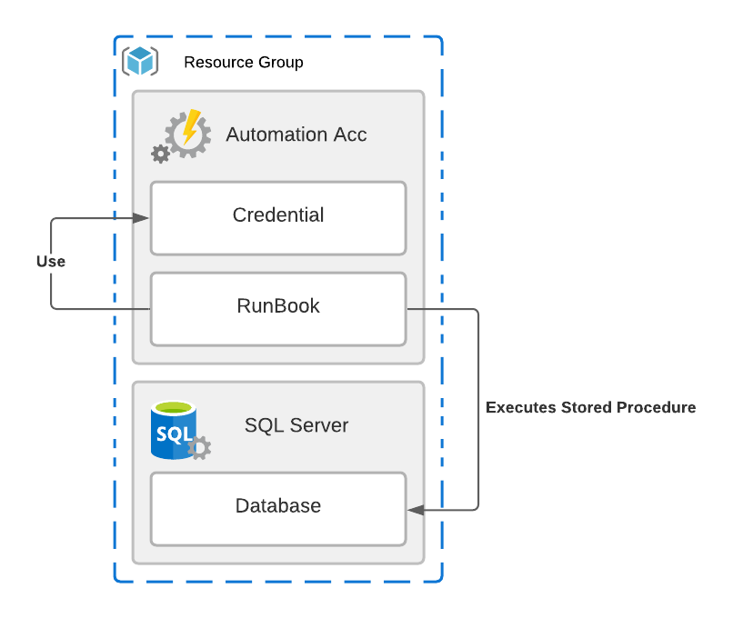

# Hello Azure Automation

An example on how use Azure Automation Runbook to execute operations against Azure SQL Databases.<br />
The Terraform file creates an instance of Azure SQL Server, Database and Database Objects as well an Azure Automation Account with a RunBook that is triggered hourly to execute a Stored Procedure via PowerShell.



## Dependencies

- [Azure CLI](https://docs.microsoft.com/cli/azure/install-azure-cli)
- [Terraform](https://www.terraform.io/downloads.html)
- [sqlcmd](https://docs.microsoft.com/sql/tools/sqlcmd-utility)

## Running the project

```sh
$ cd env/
$ az login
$ terraform init
$ terraform apply -var resource_group_name="myrg"
```
